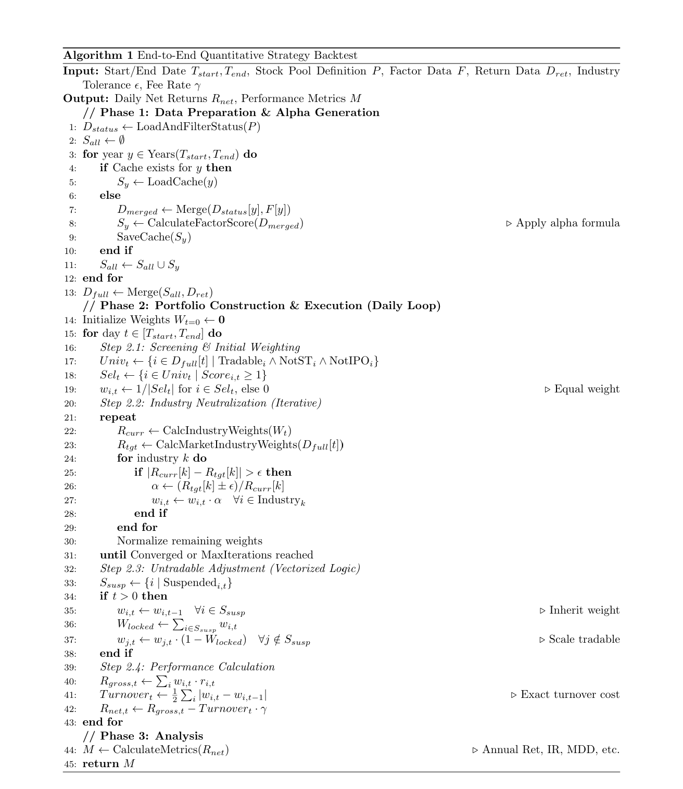

[简体中文](./readme(ch).md) | English

# 📈 Quantitative Strategy Backtesting Framework V2.0

Quantitative Multi-Factor Strategy Backtesting Framework V2.0

# 📖 Introduction

This is an engineering-oriented, lightweight yet fully functional quantitative strategy backtesting framework.

This project aims to solve common pain points in traditional script-based backtesting code ("spaghetti code"):

❌ **Coupled Logic**: Data loading, strategy calculation, and performance analysis are mixed together, making maintenance difficult.

❌ **Low Computational Efficiency**: Every parameter tuning requires reloading massive historical data and recalculating factors.

❌ **Data Pollution**: Intermediate files generated during backtesting are mixed with raw data.

❌ **Inaccurate Cost Estimation**: Ignoring transaction costs for delisted stocks or stocks removed from the pool leads to inflated net asset values.

Version 2.0 provides an efficient and rigorous backtesting solution through modular design, intelligent caching mechanisms, and vectorized operations. It is highly suitable for quantitative beginners to understand the complete loop from factor processing to portfolio construction and performance attribution.

# ✨ Features

🚀 **Smart Caching**: Built-in intelligent caching mechanism based on configuration fingerprints (Config Hash). When you only modify the portfolio weighting logic without changing the factor formula, the system automatically reuses the previous scoring results, achieving second-level loading.

🧩 **Complete Decoupling**: I/O operations, strategy logic, portfolio construction, and performance analysis are completely separated.

⚖️ **Rigorous Portfolio Construction**:

* Implements **Iterative Industry Neutralization** algorithm.
* Contains real **Untradable Weight Inheritance** logic (Vectorized full-matrix operation).

💰 **Precise Cost Calculation**: Fixes bugs in traditional backtesting where transaction costs for delisted/removed stocks are omitted, calculating real turnover based on full-matrix differencing.

📊 **Flexible Stock Pools**: Supports seamless switching between Full Market (All), Broad-Based Indices (800/1000), and Custom Strategy Pools (HighBeta/LowBeta).

# 🏗️ Directory Structure

~~~text
strategy_framework/
├── config.py           # [Control Center] Global parameters, path management, logic mapping (Single modification entry point)
├── main.py             # [Launcher] Schedules modules, controls backtest lifecycle
├── data_loader.py      # [Data Layer] Reads Parquet, cleans and filters stock pools
├── factor_engine.py    # [Strategy Layer] Writes factor scoring formulas (Alpha Model)
├── portfolio.py        # [Portfolio Layer] Core backtest logic: Industry constraints, suspension handling
├── analysis.py         # [Analysis Layer] Calculates daily returns, fees, max drawdown, and plotting
├── utils.py            # [Toolbox] Common functions (Hashing, quantile calculation)
│
├── data/               # [Data Source] (Read-only, must be prepared by user)
│   ├── 2016/ ... 2025/ # Factor files by year (Parquet)
│   ├── ret_df.parquet  # Return rate data
│   └── BetaPool...     # Stock status and industry data
│
└── results/            # [Output] (Auto-generated, no manual creation needed)
    ├── cache/          # Intermediate score cache (Accelerates next run)
    ├── portfolio/      # Daily holding weight details (CSV)
    └── reports/        # Performance reports, net value curves (PDF/CSV)
~~~

# 🧠 Deep Dive into Core Logic

This framework follows the classic Pipeline design pattern with clear data flow:

### 1. Data Loading and Filtering (`data_loader.py`)

The framework first reads the full status file and filters it according to `STOCK_POOL` in `config.py`.

Supports **Logical Union**: For example, configuring '800' will automatically select stocks where `HighBeta800` OR `LowBeta800` is 1.

### 2. Factor Scoring and Caching (`factor_engine.py`)

* **Principle**: Converts raw factor values into standardized scores.
* **Caching Mechanism**: At startup, the program generates a unique MD5 hash based on `Start Date + End Date + Stock Pool + Factor Formula + Additional Factor List`.
    * If the CSV corresponding to this hash already exists in `results/cache/`, it reads it directly (Time < 1 second).
    * If not, it reads raw Parquet data for calculation and writes to the cache.

### 3. Portfolio Construction (`portfolio.py`) —— Core Challenge

This is the critical step of converting "Factor Scores" into "Real Holding Weights".

**Step A: Basic Screening**

Filters out stocks with untradable status on the day. Selection conditions:

~~~text
Normal Trading (TradeStatus=1, SwingStatus=1)

Non-Limit Up/Down (StopTradeStatus=1)

Non-IPO (IpoStatus=1)

Factor Score Qualified (Score >= 1)
~~~

**Step B: Iterative Industry Neutralization**

To prevent the strategy from excessive exposure to a specific industry (industry betting), the framework uses an iterative method to adjust weights so that the holding's industry distribution approximates the market benchmark.

Algorithm Logic:

~~~text
Calculate market-wide industry weight proportion (Target).

Calculate current holding industry weight proportion (Current).

If Deviation < Threshold, stop iteration.

Overweight Industry: Uniformly reduce weights of all stocks in that industry.

Underweight Industry: Uniformly increase weights of all stocks in that industry.

Normalize remaining weights, repeat steps until convergence.
~~~

**Step C: Untradable (Suspension) Adjustment**

Simulates the scenario in real trading where suspended stocks cannot be sold:

~~~text
Forced Inheritance: If a stock is suspended today, its weight is forced to equal yesterday's weight (Locked Position).

Squeeze Effect: Suspended stocks occupy position space; remaining available capital (1 - Suspended Weight) is distributed proportionally to other tradable stocks.

Vectorized Implementation: Uses Pandas Pivot tables for full-matrix operations, avoiding inefficient loops.
~~~

### 4. Performance Analysis (`analysis.py`)

* **Precise Turnover**: Traditional backtesting often uses `groupby.diff()` to calculate turnover, which misses selling costs when stocks are removed from the pool. This framework uses full-matrix differencing `abs(Weight_t - Weight_t-1)` to precisely capture every transaction entry and exit.
* **Metric Output**:
    * **IR (Information Ratio)**: Excess Return / Tracking Error.
    * **IR2 (Modified Information Ratio)**: (Excess Return - Max Drawdown / 3) / Tracking Error. Introduces drawdown penalty to penalize strategies with historical "deep pits".

# 🚀 Quick Start

### 1. Environment Preparation

~~~text
pip install pandas numpy matplotlib pyarrow
~~~

### 2. Data Preparation

Please ensure a `data/` folder exists in the project root directory and store Parquet format factor data by year.
*(Note: This project does not include sample data; users must provide their own)*.

### 3. Configure Strategy

Open `config.py`. This is the only file you need to modify frequently:

~~~python
class Config:
    START_DATE = '20160108'
    END_DATE   = '20250218'
    STOCK_POOL = 'all'        # Options: '800', '1000', 'LowBeta800'
    RET_IDX    = 'open5twap'  # Return mode
    SIGN       = 'Test_Run_v1' # Label for this experiment
    
    # Define additional factor files to merge
    ADDITIONAL_FACTORS = [] 
~~~

### 4. Write Factor Formula

Open `factor_engine.py` and modify the scoring logic in the `calculate_score` function:

~~~python
# Example: Select top 30% stocks ranked by Alpha95 factor
score = (1 * (Alpha95 <= mquantiles(Alpha95, 0.3)))
~~~

### 5. Run Backtest

~~~bash
python main.py
~~~

### 6. View Reports

After completion, enter the `results/reports/` directory:

📈 Open `Chart_all_Test_Run_v1.pdf` to view the net value trend chart.

📄 Open `Summary_Test_Run_v1.csv` to view metrics like annualized return and max drawdown.

# ❓ FAQ

**Q: I modified the factor formula, why didn't the results change?**
A: Please check the parameters in `config.py`. If the date, stock pool, and return mode haven't changed, the program might directly hit the cache.
**Solution:**

~~~text
Modify the SIGN field in config.py (Recommended).
Or manually delete files under results/cache/.
~~~

**Q: How to add new year data?**
A: No code modification is needed. Just place the new year folder (e.g., 2026) into the `data/` directory and ensure it contains parquet files.

# 🧬 Algorithm Flow

# 🤝 Contributing

Issues and Pull Requests are welcome to improve this framework!